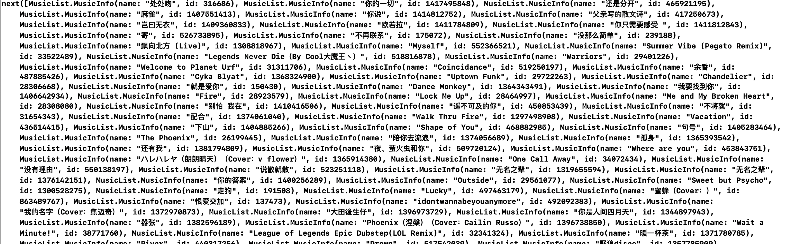
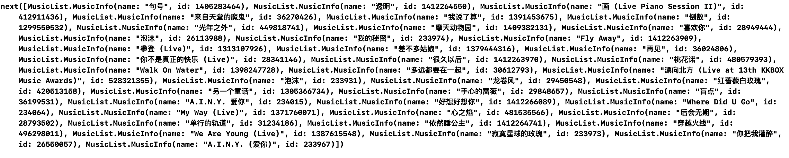

## 音乐下载，搜索，热门音乐列表获取

**注**：资源爬取自：http://www.gequdaquan.net/gqss/

**仅作学习练习使用，勿作商用**

### 一. 获取音乐列表

```
MusicTool.shared.allMusicListOf(id: .ticTocHot)
            .subscribe { (infos) in
                print("\(infos)")
        }.disposed(by: disposeBag)
```

支持的Id类型如下：

```
enum MusicID: Int64 {
    case cloudHot = 3778678 // 云音乐热歌榜
    case ticTocHot = 2248307886 // 抖音热歌
    case cloudNew = 3779629 // 云音乐新歌榜
    case chineseHot = 4395559 // 华语金曲榜
    case chinaTopOfInner = 64016 // 中国TOP排行榜（内地榜）
    case chinaTopOfHKT = 112504 // 中国TOP排行榜（港台榜）
    case cloudSoar = 19723756 // 云音乐飙升榜
    case cloudOrigin = 2884035 // 网易原创歌曲榜
    case classicOld = 440103454 // 经典怀旧
}
```

输出：



### 二. 获取音乐下载链接

```
MusicTool.shared.fetchMusicUrl(id: 1417495848) // id在获取音乐列表时可得
            .subscribe { (url) in
                print(url)
        }.disposed(by: disposeBag)
```

输出：

```
next(http://m7.music.126.net/20200128174813/5b5ade2952c0f49470df771868e151fd/ymusic/025d/0f52/560f/575dd9d27b88fdb31acaaec10feb15d1.mp3)
```

### 三. 搜索音乐

```
MusicTool.shared.searchMusicOf(author: "邓紫棋", page: 1, count: 40)
    .subscribe({ (infos) in
    		print("\(infos)")
    })
    .disposed(by: disposeBag)
```

输出：



### 四. 音乐下载

根据**三**中获取的下载链接下载：

```
        let url = "http://m7.music.126.net/20200128174813/5b5ade2952c0f49470df771868e151fd/ymusic/025d/0f52/560f/575dd9d27b88fdb31acaaec10feb15d1.mp3"
        MusicTool.shared.downloadMusic(url: url, name: "fileName")
```

或者直接根据获取的Id下载：

```
MusicTool.shared.searchMusicOf(author: "邓紫棋", page: 1, count: 40)
            .subscribe({ (infos) in
                infos.element?.forEach({ (info) in
                    MusicTool.shared.downloadMusic(id: info.id, name: info.name)
                })
            })
            .disposed(by: disposeBag)
```

